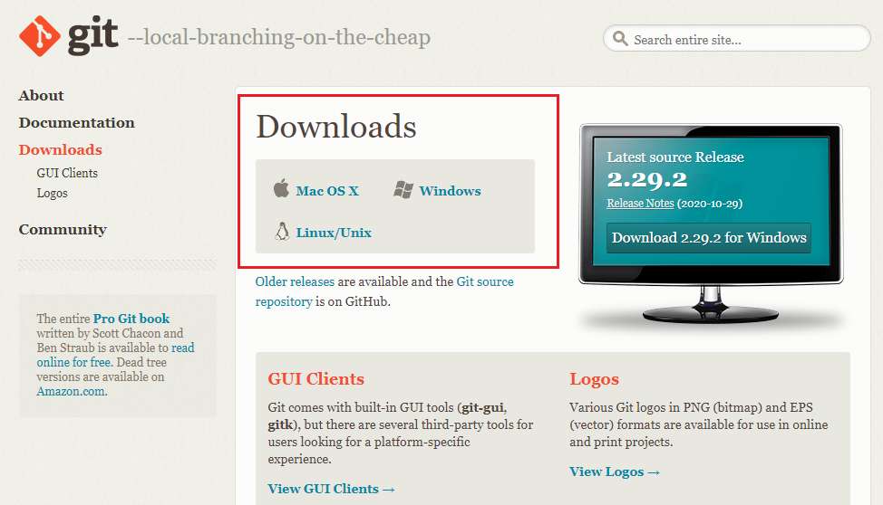

```{r setup, include=FALSE}
knitr::opts_chunk$set(echo = TRUE)
```

# História do Git

Quantas vezes você já salvou o mesmo arquivo, com versões diferentes, só para não perder nada? E quando o arquivo sumia e ia parar em Nárnia? Desesperador, não é mesmo?! Só de pensar, já dá um friozinho na barriga.

```{r pensativo, echo=FALSE ,fig.align ='center',out.width = '50%'}

```

Pois é, acredito que todos nós já fizemos isso, nem que tenha sido uma única vez (que sorte a sua se foi apenas uma vez). Após muitos anos com essa angústia toda vez que começávamos algum projeto, graças a Linus Torvalds, o famoso criador do kernel do sistema operacional Linux, nunca mais teremos que passar por isso.

```{r emocionada, echo=FALSE ,fig.align ='center',out.width = '50%'}

```

Caso vocês ainda não saibam do que exatamente estamos falando, vamos contar um pouquinho mais sobra a salvação das nossas vidas: o Controle de Versão. Mas o que seria isso? Bom, o Controle de Versão é um sistema com a finalidade de gerenciar versões de um mesmo documento. Com ele você pode tranquilamente "voltar" a uma versão anterior ou "avançar" versões. Para explicar melhor, vamos voltar lá nos anos 2000. Tudo começou quando a empresa que guardava todo o código do kernel no Linux (a Bitkeeper) teve uma queda junto com a Linux Fundation. Isso fez com que a empresa retirasse o direito do Linux de ser isento, ou seja, de não pagar pelos usos da ferramenta. 

Vamos contar um pouquinho do que é o Git e o que ele pode fazer por você. E foi aí que o criador do Linux, Linus Torvalds, se recusou a pagar os serviços da Bitkeeper, que eram ruins na época e teve a brilhante ideia de criar uma nova forma de controle de versão, o Git. E, adivinhem?! Ele realmente criou e, de longe, o Git é o sistema de controle de versão moderno mais usado no mundo.

```{r empolgado, echo=FALSE ,fig.align ='center',out.width = '50%'}
knitr::include_graphics("img/empolgado.gif")
```

# Git, GitHub e RStudio

O Git é um programa que gerencia todas as alterações realizadas em um diretório. Em geral, é usado para códigos, mas pode ser usado para qualquer tipo de arquivo. Junto com o Git, vamos apresentar a vocês também o GitHub. É uma plataforma de hospedagem de código para controle de versão e colaboração, para armazenar todas as versões do seu projeto baseado em Git na Internet. Ele permite que você e outras pessoas trabalhem juntos em projetos de qualquer lugar.

O RStudio é um conjunto de ferramentas integradas projetadas (IDE - Integrated Development Environment) da linguagem R para editar e executar os códigos em R. O R, em combinação com o RStudio, possui um conjunto de funcionalidades cuja intenção é ajudar no processo de desenvolvimento. (tá igual o slide da Agatha, mudar)

## Como obter?

Agora você deve estar pensando "beleza, mas e aí? Como faço para adquirir essas maravilhas?". Calma, aos poucos vamos explicando melhor como começar a usá-las e o que elas podem fazer por você. 

### Git

```{r git logo, echo = FALSE, fig.align = 'center', out.width = "10%"}
knitr::include_graphics("https://git-scm.com/images/logo@2x.png")
```

Bom, primeiramente, você vai precisar fazer o [download](https://git-scm.com/downloads). Nesse link, você encontrará vários sistemas operacionais, clique em cima do seu sistema que o download começará logo em seguida. 

```{r git, echo = FALSE, fig.align = 'center', out.width = '70%'}

```

### GitHub

```{r logo, echo = FALSE, fig.align = 'center', out.width = "20%"}
knitr::include_graphics("img/github-logo.png")
```

Você vai precisar apenas criar uma conta gratuita no [GitHub](https://github.com/), caso ainda não tenha. E, se você for estudante, tem a opção do [GitHub Student Developer Pack](https://education.github.com/pack), que utiliza o email institucional da sua universidade.

### R e RStudio

Para usar o RStudio, você vai precisar primeiro baixar o [R](https://cran.r-project.org/) (base) e depois o RStudio.
